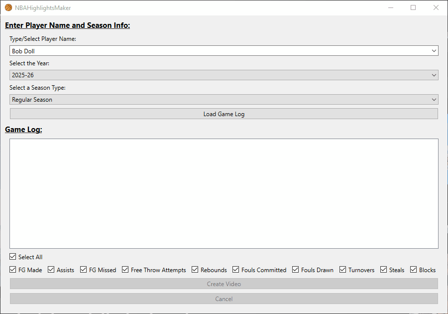
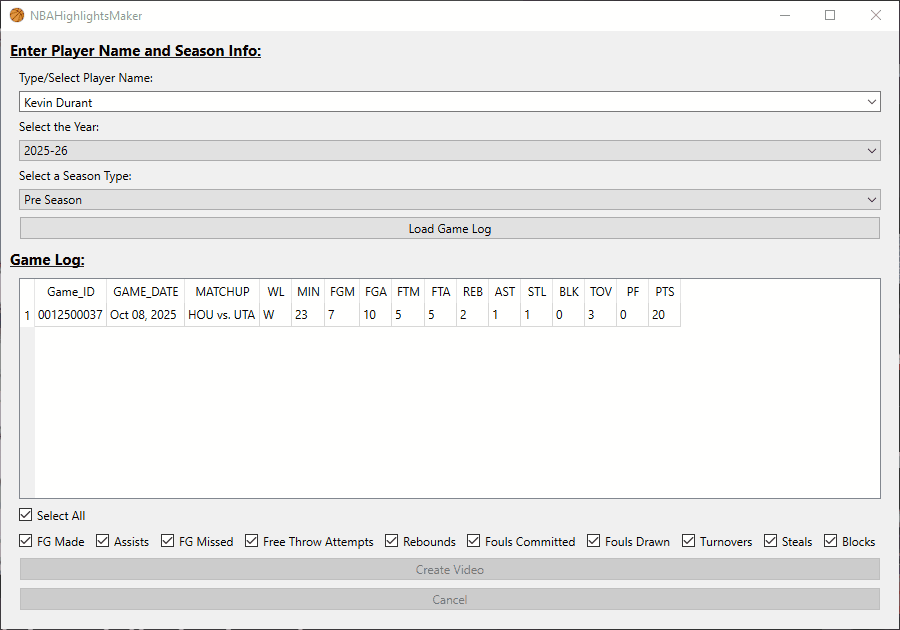
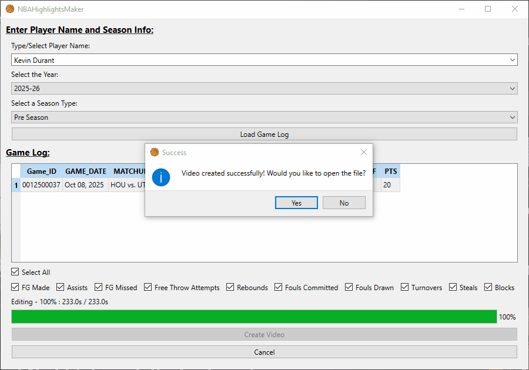

# NBAHighlightsMaker

## What is NBAHighlightsMaker?
NBAHighlightsMaker is an application where you choose a player you want highlights for, whatever game they were playing in, and the type of
actions (field goals, free throws, assists, etc..), and NBAHighlightsMaker will create a stitched together video of all the clips of that player for that game.

## How to Use
1. Choose your player, the year of the game you want to create a video of and what part of the season the game is from. Then click the Load Game Log button. A list of games from that season for that player will appear.



2. Click on the row in the game log that corresponds to your desired game. The Create Video Button will be enabled. Choose whichever actions you want, click on the button and your video will start to be created.



3. Once the process is completed, a message window will pop up asking if you want to open the file immediately. If you click no and want to find the file later on, it can be found in data/vids in your current working directory.



## Prerequisites 
1. Python >=3.12, <3.14
2. Poetry

## Dependencies
- nba-api
- pandas
- asyncio
- pyside6
- qasync
- moviepy
- proglog
- aiohttp
- fake-useragent
- aiofiles

## Installation
1. Clone the repository:
    ```bash
    git clone https://github.com/etnguyen401/NBAHighlightsMaker.git
    cd NBAHighlightsMaker
    ```
2. Install dependencies:
    ```bash
    poetry install
    ```
3. Run the Application:
    ```bash
    poetry run NBAHighlightsMaker/main.py
    ```

## Random Notes
- Each time you create a video, the data/vids folder will be wiped, so if you need anything from a previous run you need to save it somewhere else
- All the individual clips can also be found in the data/vids folder after you finish creating the video


